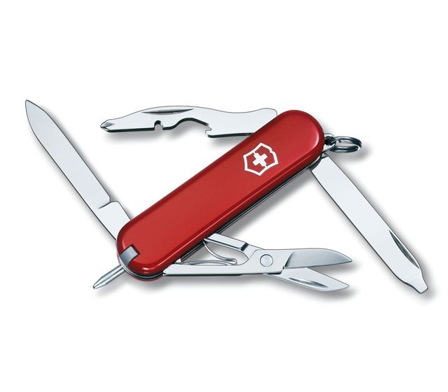

```{r setup, include=FALSE}
knitr::opts_chunk$set(echo = FALSE)
```
# Purpose
- Goals of this talk are:

>    1. Expose you to a programming language (R)
>    2. Demonstrate why you might want to use R
>    3. Show you how to download and install...R {width=20%}
>    4. Display some R examples
>    5. Provide useful R resources

>- What is *not* intended:

>    1. A step-by-step tutorial on how to use R
>    2. To convince everyone R is the language for them

# About me
- Worked at ANL since 2013
- B.Sc. 2015 in Biology and Chemistry, Elmhurst College
- M.Sc. 2019 in Environment and Sustainability, University of Saskatchewan {width=30%}

>- Only used R since 2017 for my Master's research {height=300px}


# What is R?
>- "R is a language and environment for statistical computing and graphics"– R Project 
<div style='text-align: left'>
    
</div>
>- Basically, R is an open-source tool that provides users a way to analyze and visualize data in a **reproducible** way
>- But can't I do that in Excel? I mean, the equations I use are documented in each cell and I can totally make a killer XY scatter plot.
+
<div style='text-align: left'>
    
</div>


# The good and bad of Excel
<div style = "float: left; width: 50%;">
- Excel is great for:
1. It's ease of use
2. Data entry
3. Manipulating small amounts of data that can fit into one screen

``` {r fig.align="center", fig.pos="right", out.width="600px", dpi=300}

```

</div>
<div style = "float: right; width: 50%;">
- Excel is not great for:

>1. Handling large amounts of data
>2. Automating analyses
>3. Transparency (of analyses)
>4. High-quality graphics
>5. Version control (Can overwrite the only copy of a file)
>6. **Reproducibility**

>- {width=50%} 
>- {width=60%} {width=30%}
</div>


# What exactly does **Reproducibility** mean?
- "To produce a copy of something or to show or do something again"
- And as scientists, we strive for reproducible results
    + Experimental Design: 
        + "Experiment was carried out x times with n number of samples"
    + Lab notebooks
    + Presentations
    + Publications
    ``` {r fig.align="center", out.width="600px", dpi=300, fig.cap = "https://www.nature.com/articles/s41562-016-0021"}
knitr::include_graphics("Reproducibility.jpg")
```
    
    
# In data analysis, reproducibility usually means building a **Reproducible** environment

>- This means:
>    + Keeping track of how results were produced (a roadmap from raw data to conclusions)
>    + Avoiding hidden data manipulation edits
>    + Version control (e.g. Git) where versions can be saved
>    + Clearly noting what you did and why you did it (i.e. "commenting out", #)
>    + Building a hierarchical analysis and check-points along the way
>    + Sharing your work
    
>- Reproducible work:
>    + Enables efficient collaboration
>    + Makes your future-self less prone to this {width=30%}


# You can't spell reproducible without **R**
- R excels at:
1. Handling large amounts of data
2. Automating analyses
3. Transparency (of analyses)
4. High-quality graphics
    i) Extremely customizable (size, resolution, filetype, etc.)
5. Version control (R makes any imported file an object and does not overwrite)
6. Handling diverse file types
7. Analysis Checkpoints (Allows users to put tests in place to identify errors)
8. **Highly Reproducible**
9. Creating Reports and Presentations (Like this one!)


# Will I really ever need to learn R?
<div style = "float: left; width: 50%;">
- Industries that use R the most
{height=700px}
</div>

<div style = "float: right; width: 50%;">
- Top tier companies using R:
{height=200px}
1. Facebook 
2. Google
3. Twitter
4. Microsoft
5. Uber
</div>


# But who cares about big tech using R, how will it help *me* as an aspiring scientist?
``` {r fig.align="center", out.width="425px", dpi=300}
knitr::include_graphics("Aspiring.jpg")
```
<div style = "float: left; width: 50%;">
>- R is one of the most used softwares for academic articles {width=500px}
</div>
<div style = "float: right; width: 50%;">
>- R has tons of packages for nearly every field of science {width=700px}
</div>


# Packages? What packages? {width=125px}
- R is a programming language that can use "packages" to accomplish nearly any task

>- Analogy time:
>    + Imagine R is a basic swiss army pocket knife {width=200px}
>    + Packages are the can openers, cork screws, serrated blades, tweezers, etc. {width=225px}
>    + You can accomplish nearly any task with a basic swiss army pocket knife (Base R), but that nail file is a game-changer {width=225px}


# Where to download R

>- https://cran.r-project.org/mirrors.html 
>    1. Choose location nearest you {width=700px}
>    2. Download for your operating system {width=700px}
>    3. Install R for the first time {width=700px}
>    4. Download latest R version (Here, 3.6.1) for your operating system {width=700px}

>- Downloading R Tutorial: https://medium.com/@GalarnykMichael/install-r-and-rstudio-on-windows-5f503f708027

# Download RStudio (Integrated Development Environment)

>- An IDE is a way to interact with R language without using the command line (Windows)/ terminal (macOS)
>- https://www.rstudio.com/products/rstudio/download/#download
>    1. Click "RStudio Desktop-Free-Download" {width=250px}
>    2. Download for your OS in "Installers for Supported Platforms" {width=700px}

# This is all great and I'm loving it, but what can R actually do?

>- Some Capabilities of R:
>    1. Creates reproducible Word, Powerpoint, PDF, and HTML Documents  {width=200px}
>    2. Build interactive web apps 
>    3. Use other programming languages with/within R {width=150px}
>    4. Machine Learning
>    5. Produce interactive plots
>    6. Web-scrape data {width=500px}

>- More: https://blog.revolutionanalytics.com/2012/07/a-big-list-of-the-things-r-can-do.html

# R Example: Variable Assignment and Arithmetic
<font size="8">
```{r echo=TRUE, warning=FALSE, message=FALSE}
x <- 2 # read as "assign x to be a value of 2"
y <- 10 # read as "assign y to be a value of 10"
print(x + y) # read as "show me what x plus y equals"
```

</font>

# R Example: Importing Excel File

{width=1000px}

```{r echo=TRUE, warning=FALSE, message=FALSE}
excel_data <- readxl::read_xlsx("excel_example.xlsx")
head(excel_data) # show the first 6 rows
```


# R Example: Map of Study Sites from Thesis

{width=1200px}

-Thesis link: https://harvest.usask.ca/bitstream/handle/10388/11889/DYLLA-THESIS-2019.pdf?sequence=1&isAllowed=y


# R Example: Interactive Population Map of USA
<font size="5">
```{r echo=TRUE, warning=FALSE, message=FALSE, fig.height=12, fig.width=16}
library(plotly)
df <- read.csv('https://raw.githubusercontent.com/plotly/datasets/master/2014_us_cities.csv')

df$q <- with(df, cut(pop, quantile(pop)))
levels(df$q) <- paste(c("1st", "2nd", "3rd", "4th", "5th"), "Quantile")
df$q <- as.ordered(df$q)

g <- list(
  scope = 'usa',
  projection = list(type = 'albers usa'),
  showland = TRUE,
  landcolor = toRGB("gray85"),
  subunitwidth = 1,
  countrywidth = 1,
  subunitcolor = toRGB("white"),
  countrycolor = toRGB("white")
)

p <- plot_geo(df, locationmode = 'USA-states', sizes = c(1, 250)) %>%
  add_markers(
    x = ~lon, y = ~lat, size = ~pop, color = ~q, hoverinfo = "text",
    text = ~paste(df$name, "<br />", df$pop/1e6, " million")
  ) %>%
  layout(title = '2014 US city populations<br>(Click legend to toggle)', geo = g)
p
```

</font>

# R Example: Interactive 3D Bubble Plot of Life Expectancy vs GDP vs Population
<font size="5">
```{r echo=TRUE, warning=FALSE, message=FALSE, fig.height=12, fig.width=16}
data <- read.csv("https://raw.githubusercontent.com/plotly/datasets/master/gapminderDataFiveYear.csv")

data_2007 <- data[which(data$year == 2007),]
data_2007 <- data_2007[order(data_2007$continent, data_2007$country),]
data_2007$size <- data_2007$pop
colors <- c('#4AC6B7', '#1972A4', '#965F8A', '#FF7070', '#C61951')

pl <- plot_ly(data_2007, x = ~gdpPercap, y = ~lifeExp, z = ~pop, color = ~continent, size = ~size, colors = colors,
             marker = list(symbol = 'circle', sizemode = 'diameter'), sizes = c(5, 150),
             text = ~paste('Country:', country, '<br>Life Expectancy:', lifeExp, '<br>GDP:', gdpPercap,
                           '<br>Pop.:', pop)) %>%
  layout(title = 'Life Expectancy v. Per Capita GDP, 2007',
         scene = list(xaxis = list(title = 'GDP per capita (2000 dollars)',
                      gridcolor = 'rgb(255, 255, 255)',
                      range = c(2.003297660701705, 5.191505530708712),
                      type = 'log',
                      zerolinewidth = 1,
                      ticklen = 5,
                      gridwidth = 2),
               yaxis = list(title = 'Life Expectancy (years)',
                      gridcolor = 'rgb(255, 255, 255)',
                      range = c(36.12621671352166, 91.72921793264332),
                      zerolinewidth = 1,
                      ticklen = 5,
                      gridwith = 2),
               zaxis = list(title = 'Population',
                            gridcolor = 'rgb(255, 255, 255)',
                            type = 'log',
                            zerolinewidth = 1,
                            ticklen = 5,
                            gridwith = 2)),
         paper_bgcolor = 'rgb(243, 243, 243)',
         plot_bgcolor = 'rgb(243, 243, 243)')
pl
```

</font>

# Useful R Links
- Free Resources
    + RStudio Resources: https://www.rstudio.com/online-learning/#r-programming
    + UCLA: https://stats.idre.ucla.edu/
    + 2 minute R Tutorials: https://www.youtube.com/playlist?list=PLcgz5kNZFCkzSyBG3H-rUaPHoBXgijHfC
    + Short R Course: http://faculty.washington.edu/tlumley/Rcourse/
    + Statistics in R: http://zoonek2.free.fr/UNIX/48_R/all.html (ANL Blocked)
    + "R by Example": http://www.mayin.org/ajayshah/KB/R/index.html

>- Blogs (Actually super useful)
>    + R Bloggers: https://www.r-bloggers.com/
>    + ComputerWorld: https://www.computerworld.com/article/2497143/business-intelligence-beginner-s-guide-to-r-introduction.html
>    + Interesting Topics: https://blog.revolutionanalytics.com/
>    + Excel vs. R: https://www.jessesadler.com/post/excel-vs-r/

>- Communities
>    + StackOverflow: https://stackoverflow.com/questions/tagged/r
>    + Twitter: https://twitter.com/search?q=%23rstats

>- Books
>    + Free 
>         + "R for Data Science": https://r4ds.had.co.nz/
>         + "An Introduction to R": https://cran.r-project.org/doc/manuals/R-intro.pdf
>    + Not Free
>         + "R Cookbook":https://www.amazon.com/Cookbook-Analysis-Statistics-Graphics-Cookbooks/dp/0596809158/ref=as_li_ss_tl?s=books&ie=UTF8&qid=1515977919&sr=1-4&keywords=r+cookbook&linkCode=sl1&tag=nandeshwarinf-20&linkId=102d1e38b5fb3b390f72d55ed1ce476d
>         + The Art of R Programming; https://www.amazon.com/Art-Programming-Statistical-Software-Design/dp/1593273843/ref=as_li_ss_tl?s=books&ie=UTF8&qid=1515977954&sr=1-1&keywords=The+Art+of+R+Programming&linkCode=sl1&tag=nandeshwarinf-20&linkId=8d812de94763fc2f8a551d6571a69108
>         + "R for Excel Users": https://www.amazon.com/Excel-Users-Introduction-Analysts-ebook/dp/B01K3HFOZU/ref=as_li_ss_tl?s=books&ie=UTF8&qid=1515978598&sr=1-2&keywords=r+for+excel+users&linkCode=sl1&tag=nandeshwarinf-20&linkId=956c11fdd540d039e7b8c285459f2517

>- Online Courses
>    + https://www.quora.com/What-is-the-best-online-course-to-learn-R